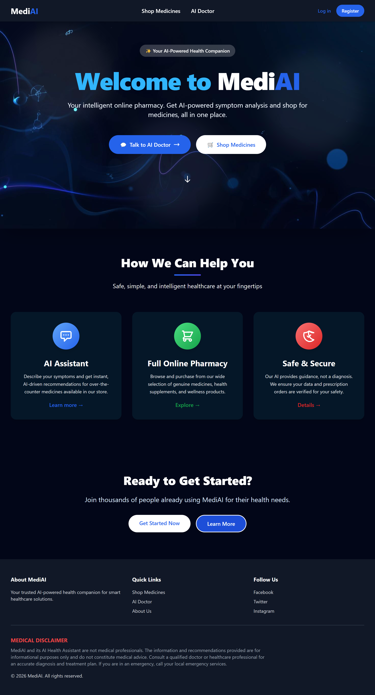

# 🏥 MediAI: Intelligent Healthcare System
> **An Advanced Full-Stack AI-Integrated Pharmacy E-commerce Platform.**

[](https://laravel.com)
[](https://php.net)
[](https://ai.google.dev/)
[](https://tailwindcss.com)

---

## 📖 Introduction
MediAI bridges the gap between traditional medicine sales and modern AI. It features a **Symptom Analyzer** powered by **Google Gemini** that recommends medicines based on your actual live database inventory.

---

## 🖼️ Project Screenshots
<p align="center">
  
  
  <br>
  
  
</p>

---

## ✨ Key Features

### 1. 🩺 AI Consultation (Doctor Service)
- **Real-time Analysis:** Analyzes symptoms using Gemini 1.5 Flash/Pro.
- **Inventory Awareness:** Only suggests medicines currently **In Stock** in your database.
- **Error Handling:** Built-in retry logic for API stability.

### 2. 🛒 Pharmacy E-commerce
- **Rx Management:** Separation of OTC and Prescription-required medicines.
- **Prescription Upload:** Users can upload `.jpg/.pdf` prescriptions during checkout.
- **Razorpay Integration:** Secure payment gateway for medicine orders.

### 3. 🛡️ Admin & Analytics
- **Inventory Control:** Complete CRUD for medicine and categories.
- **Audit Reports:** Export full inventory lists to **PDF** using DomPDF.
- **Security:** Social Login (Google OAuth) and Admin-specific middleware.

---

## 🛠️ Step-by-Step Installation

Follow these steps to set up MediAI on your local machine:

### **Step 1: Clone the Project**
```bash
git clone [https://github.com/Manish731315/MediAi-Project.git](https://github.com/Manish731315/MediAi-Project.git)
cd MediAi-Project


Step 2: Install Backend & Frontend Dependencies
# Install PHP packages
composer install

# Install JS packages and build assets
npm install
npm run build

Step 3: Setup Environment Variables
# AI Settings
GEMINI_API_KEY=your_key_here
AI_MODEL=gemini-1.5-flash

# Payments
RAZORPAY_KEY_ID=your_id
RAZORPAY_KEY_SECRET=your_secret

# Authentication
GOOGLE_CLIENT_ID=your_id
GOOGLE_CLIENT_SECRET=your_secret
GOOGLE_REDIRECT_URL=[http://127.0.0.1:8000/auth/google/callback](http://127.0.0.1:8000/auth/google/callback)

# SMS Notifications
TWILIO_SID=your_sid
TWILIO_TOKEN=your_token
TWILIO_FROM=your_number

Step 4: Initialize Database & Storage
# Run migrations and seed data
php artisan migrate --seed

# Create storage link for images/prescriptions
php artisan storage:link

Step 5: Run the Server
php artisan serve

📁 Technical Architecture
MediAI uses a Service-Oriented Architecture for better maintainability:

app/Services/AiDoctorService.php: Core logic for AI prompt engineering.

app/Http/Controllers/Admin/: Dedicated namespace for secure admin tasks.

resources/views/admin/medicines/pdf.blade.php: Specialized PDF layout.

👨‍💻 Author
Manish Kumar

3rd-Year BCA Student @ CIMAGE Group of Institutions, Patna.

Final Year Project for Patliputra University.

Disclaimer: This project is for educational purposes. Consult a real doctor for medical advice.